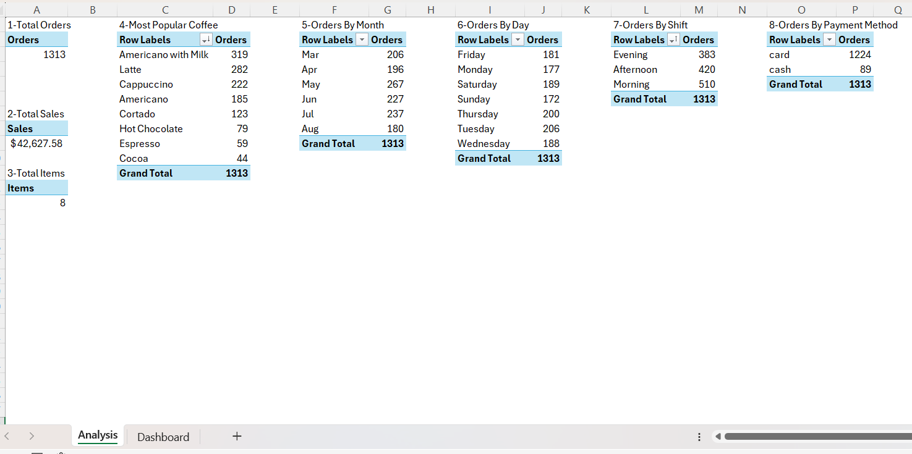

# ☕ Costa Caffe – Excel Sales Dashboard

An interactive Excel dashboard designed to analyze sales performance, customer behavior, and product popularity for a coffee shop.
The dashboard transforms raw transactional data into clear insights using Pivot Tables, Slicers, and Excel charts.

---
## 🖥️ Dashboard Preview

### **Analysis Sheet**



### **Dashboard Sheet**


------
## 📊 Dashboard Overview

The dashboard provides a full breakdown of:

* **Total Orders:** 1,313
* **Total Sales:** $42,627.58
* **Total Items (Coffee Types):** 8

It includes dynamic filters and multiple visualizations to make the analysis easy and actionable.

---

## 🔍 Key Insights

### **1️⃣ Most Popular Coffee**

* **Americano with Milk** is the top-selling item (319 orders)
* Latte and Cappuccino follow as strong performers
* Lowest-selling items include **Espresso** and **Cocoa**

---

### **2️⃣ Orders by Month**

Monthly performance shows:

* **Peak Orders in May (267)**
* Gradual decline after July
* March–July are the strongest months overall

---

### **3️⃣ Orders by Day**

Customer activity by weekday:

* **Most active day:** Tuesday (206 orders)
* Closely followed by Thursday and Saturday
* Sunday is the slowest day (172 orders)

---

### **4️⃣ Orders by Shift**

* **Morning shift leads** with 510 orders
* Afternoon (420) and Evening (383) follow
* Morning traffic is the primary revenue driver

---

### **5️⃣ Payment Method Trends**

* **Card payments dominate (93%)**
* Cash payments are minimal (7%)
* Indicates a modern, cashless customer base

---

## 🛠️ Tools & Techniques Used

### **Excel Features**

* Pivot Tables
* Slicers for interactive filtering
* Bar, Line, Pie, and Treemap Charts
* Conditional formatting
* Basic data cleaning & structuring

### **Skills Demonstrated**

* Data Analysis
* KPI Tracking
* Dashboard Design
* Pattern & Trend Identification

---


## 📎 Project Purpose

A personal data analysis project designed to practice dashboard building, performance analysis, and turning raw Excel data into actionable insights for business decision-making.

---

## 📂 File Structure

```
/Costa-Caffe-Dashboard
│── Analysis.xlsx
│── Dashboard.png
│── Analysis.png
└── README.md
```

---

## ⭐ Summary

This Excel dashboard showcases the ability to analyze multi-dimensional sales data, uncover trends, and present insights visually.
It demonstrates strong practical skills in **Excel reporting**, **business intelligence**, and **data storytelling**.

